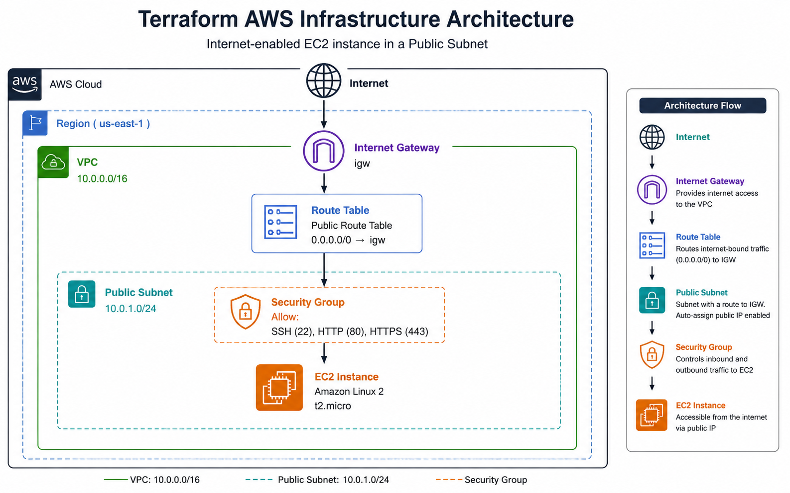
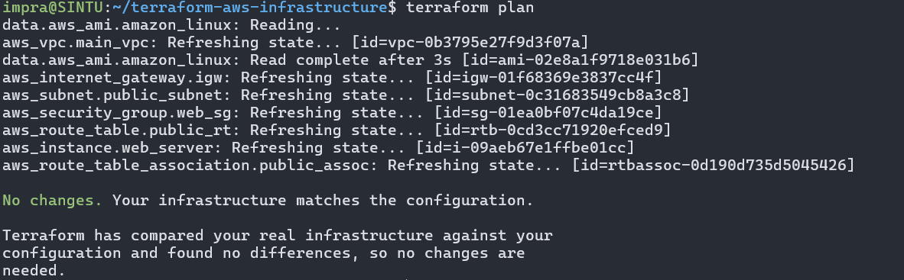
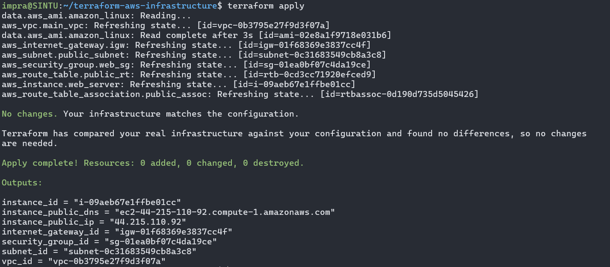
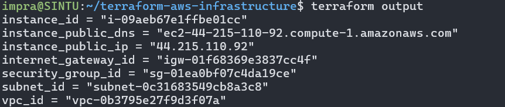
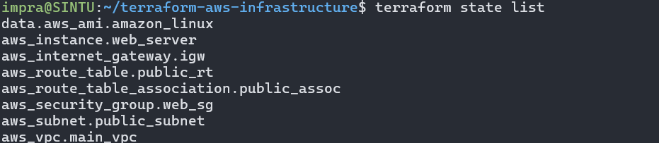
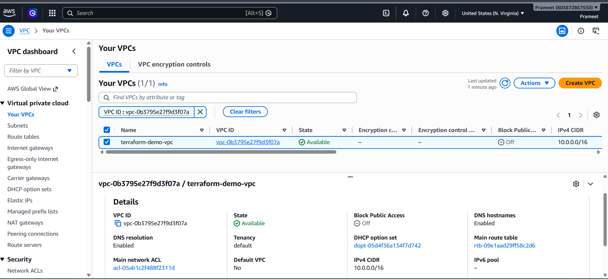
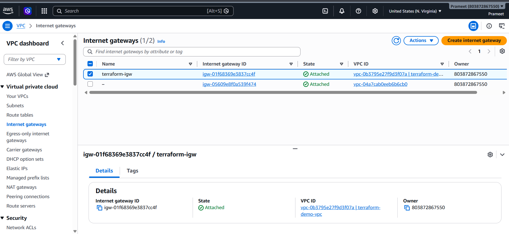
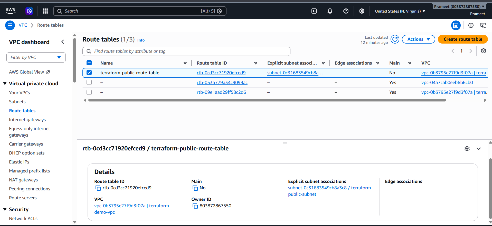
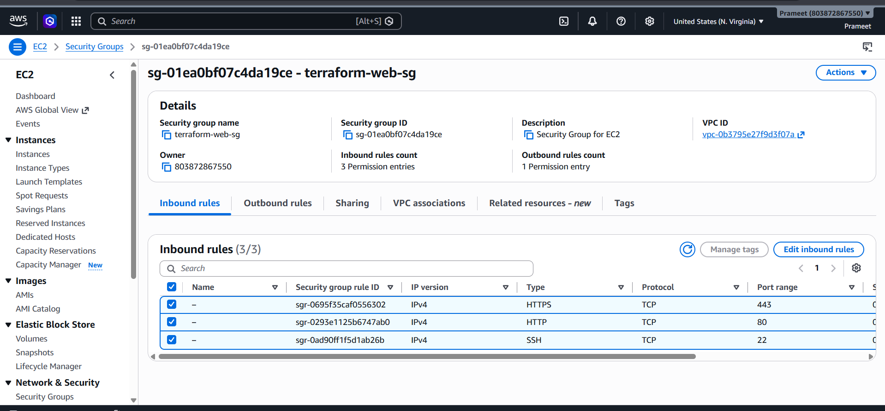
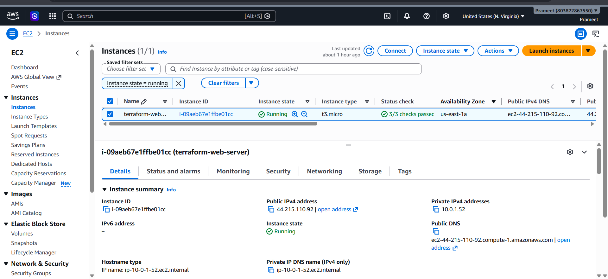

# 🚀 Terraform AWS Infrastructure using Infrastructure as Code (IaC)

<p align="center">


</p>

---

# 📖 Project Overview

Infrastructure provisioning is one of the most repetitive and error-prone tasks when performed manually through the AWS Management Console. As cloud environments grow, manually creating networking resources, security groups, and compute instances becomes difficult to maintain, reproduce, and scale.

This project demonstrates how **Terraform**, an Infrastructure as Code (IaC) tool, can automate AWS infrastructure provisioning using declarative configuration files.

Instead of manually creating cloud resources, Terraform provisions the complete environment in a repeatable, version-controlled, and automated manner.

The infrastructure created in this project includes:

- Custom Virtual Private Cloud (VPC)
- Public Subnet
- Internet Gateway
- Route Table
- Route Table Association
- Security Group
- Amazon EC2 Instance
- Terraform Outputs

The entire infrastructure can be deployed using only a few Terraform commands.

---

# 🎯 Project Objectives

The primary objectives of this project are:

- Learn Infrastructure as Code (IaC) principles
- Automate AWS infrastructure deployment
- Build reusable infrastructure using Terraform
- Understand AWS networking components
- Manage cloud resources using version control
- Eliminate manual infrastructure configuration
- Demonstrate Terraform best practices for DevOps environments

---

# 🏗️ Solution Architecture

<p align="center">

## 📷 Architecture Diagram

> Replace the image below with your architecture diagram.

```text
architecture-diagram.png
```

## Architecture Diagram



The following architecture was provisioned entirely using Terraform.
```

</p>

---

# 🌐 Infrastructure Architecture

```
                    Internet
                        │
                        │
                Internet Gateway
                        │
                        │
                Route Table
                        │
                        │
               Public Subnet
                        │
                        │
                 Security Group
                        │
                        │
                  EC2 Instance
```

---

# ⚙️ AWS Services Used

| AWS Service | Purpose |
|-------------|---------|
| Amazon VPC | Creates an isolated virtual network |
| Public Subnet | Hosts publicly accessible resources |
| Internet Gateway | Provides Internet connectivity |
| Route Table | Controls network routing |
| Security Group | Acts as a virtual firewall |
| Amazon EC2 | Hosts the virtual server |
| Terraform | Automates infrastructure deployment |

---

# ✨ Features

✔ Infrastructure as Code using Terraform

✔ Fully automated AWS resource provisioning

✔ Custom Virtual Private Cloud

✔ Public networking configuration

✔ Internet connectivity through Internet Gateway

✔ Route Table configuration

✔ Security Group configuration

✔ EC2 instance deployment

✔ Infrastructure outputs

✔ Reusable Terraform configuration

✔ Version-controlled infrastructure

✔ Easy deployment and destruction

---

# 📂 Repository Structure

```text
terraform-aws-infrastructure/
│
├── .gitignore
├── .terraform.lock.hcl
├── provider.tf
├── variables.tf
├── main.tf
├── outputs.tf
├── README.md
│
├── architecture-diagram.png
│
└── screenshots/
    ├── 01-terraform-init.png
    ├── 02-terraform-validate.png
    ├── 03-terraform-plan.png
    ├── 04-terraform-apply.png
    ├── 05-vpc.png
    ├── 06-subnet.png
    ├── 07-internet-gateway.png
    ├── 08-route-table.png
    ├── 09-security-group.png
    └── 10-ec2-instance.png
```

---

# 📁 Terraform Configuration Files

| File | Description |
|------|-------------|
| provider.tf | Configures AWS provider and region |
| variables.tf | Stores reusable input variables |
| main.tf | Defines AWS infrastructure resources |
| outputs.tf | Displays important Terraform outputs |
| .terraform.lock.hcl | Maintains provider version consistency |
| .gitignore | Prevents sensitive and generated files from being committed |

---

# 🔑 Key Benefits

Using Terraform provides several advantages over manual infrastructure provisioning:

- Infrastructure becomes reproducible and consistent.
- Cloud resources are managed through version control.
- Infrastructure changes can be reviewed before deployment.
- Human errors are significantly reduced.
- Deployments become faster and repeatable.
- Infrastructure can be recreated in different environments with minimal effort.
- Teams can collaborate using a shared Infrastructure as Code workflow.

- ---

# 📋 Prerequisites

Before deploying this infrastructure, ensure the following tools are installed and configured.

| Tool | Version |
|------|---------|
| Terraform | v1.x or later |
| AWS CLI | Latest |
| Git | Latest |
| GitHub Account | Required |
| AWS Account | Required |

---

# 🔐 AWS Credentials Configuration

Terraform authenticates using the AWS CLI credentials configured on your local machine.

Verify your credentials:

```bash
aws configure
```

Example:

```text
AWS Access Key ID     : ********************
AWS Secret Access Key : ********************
Default region        : us-east-1
Output format         : json
```

Verify the authenticated user:

```bash
aws sts get-caller-identity
```

---

# ⚡ Terraform Workflow

Terraform follows a simple lifecycle to provision infrastructure.

```text
Write Configuration
        │
        ▼
terraform init
        │
        ▼
terraform validate
        │
        ▼
terraform plan
        │
        ▼
terraform apply
        │
        ▼
Infrastructure Created
```

To remove infrastructure:

```text
terraform destroy
```

---

# 🚀 Deployment Steps

## Step 1 — Clone Repository

```bash
git clone https://github.com/Prameet-26/terraform-aws-infrastructure.git

cd terraform-aws-infrastructure
```

---

## Step 2 — Initialize Terraform

```bash
terraform init
```

Purpose:

- Downloads required provider plugins
- Initializes backend
- Creates the `.terraform` directory
- Generates `.terraform.lock.hcl`

Expected output:

```text
Terraform has been successfully initialized!
```

---

## Step 3 — Validate Configuration

```bash
terraform validate
```

Purpose:

- Checks Terraform syntax
- Validates configuration files
- Detects configuration errors before deployment

Expected output:

```text
Success! The configuration is valid.
```

---

## Step 4 — Review Execution Plan

```bash
terraform plan
```

Purpose:

- Displays infrastructure changes before deployment
- Shows resources to be created
- Allows safe review before applying changes

Terraform displays resources similar to:

- VPC
- Public Subnet
- Internet Gateway
- Route Table
- Route Table Association
- Security Group
- EC2 Instance

---

## Step 5 — Deploy Infrastructure

```bash
terraform apply
```

Confirm deployment:

```text
Enter a value:

yes
```

Terraform provisions all AWS resources automatically.

Expected output:

```text
Apply complete!

Resources:
7 added
```

---

## Step 6 — Verify Resources

Open the AWS Console and verify:

- VPC
- Public Subnet
- Internet Gateway
- Route Table
- Security Group
- EC2 Instance

All resources should appear successfully.

---

# 🏗 Infrastructure Components

## 🌐 Virtual Private Cloud (VPC)

The VPC acts as the foundational networking layer for the project.

Responsibilities:

- Provides isolated networking
- Defines IP address range
- Hosts all AWS resources

---

## 🌍 Public Subnet

The public subnet hosts resources that require Internet connectivity.

Responsibilities:

- Allocates IP addresses
- Enables public resource deployment
- Connected to the Route Table

---

## 🌐 Internet Gateway

The Internet Gateway enables communication between the VPC and the public Internet.

Without an Internet Gateway:

- EC2 instances cannot access the Internet
- SSH access is unavailable
- Package installation fails

---

## 🛣 Route Table

The Route Table controls traffic flow inside the VPC.

It contains routes directing traffic to:

- Local VPC network
- Internet Gateway

This enables outbound Internet communication.

---

## 🔗 Route Table Association

Associates the Route Table with the Public Subnet.

Without this association:

- Internet traffic cannot reach the subnet.

---

## 🔒 Security Group

Acts as a virtual firewall for the EC2 instance.

Security Groups define:

- Allowed inbound traffic
- Allowed outbound traffic

Typical rules include:

- SSH (22)
- HTTP (80)
- HTTPS (443)

---

## 💻 Amazon EC2 Instance

The EC2 instance represents the compute layer of the infrastructure.

Terraform provisions the instance automatically using:

- Amazon Linux AMI
- Instance type
- Security Group
- Public Subnet

The EC2 instance receives a Public IP, allowing secure remote access.

---

# 📤 Terraform Outputs

Terraform displays useful information after deployment.

Example outputs:

```text
instance_id
instance_public_ip
vpc_id
subnet_id
```

These outputs simplify infrastructure verification and future automation.

------

# 📸 Project Screenshots

The following screenshots demonstrate the successful execution of the Terraform workflow and the AWS infrastructure created during this project.

## Terraform Commands

### Terraform Plan

Terraform validates the current infrastructure state and generates an execution plan before deployment.


---

### Terraform Apply

Terraform provisions the AWS infrastructure and displays the generated outputs.


---

### Terraform Output

Terraform outputs provide important resource identifiers such as EC2 Public IP, Instance ID, VPC ID and Subnet ID.


---

### Terraform State

Terraform keeps track of all managed resources inside its state file.



### VPC

Custom Virtual Private Cloud created using Terraform.



---

### Public Subnet


---

### Internet Gateway



---

### Route Table



---

### Security Group



---

### EC2 Instance

Amazon Linux EC2 instance launched inside the public subnet.



---

# 📊 Infrastructure Summary

| Resource | Status |
|----------|--------|
| VPC | ✅ Created |
| Public Subnet | ✅ Created |
| Internet Gateway | ✅ Attached |
| Route Table | ✅ Configured |
| Route Table Association | ✅ Configured |
| Security Group | ✅ Created |
| EC2 Instance | ✅ Running |

---

# 🧠 Challenges Faced

During the implementation of this project, several practical challenges were encountered and resolved.

## Challenge 1 — Understanding AWS Networking

Initially, understanding how the VPC, Subnet, Internet Gateway, Route Table, and Security Group work together required careful study.

### Solution

- Reviewed AWS networking concepts.
- Followed the complete traffic flow.
- Verified each resource in the AWS Management Console.

---

## Challenge 2 — Resource Dependencies

Terraform resources often depend on one another.

For example:

- Route Table depends on the Internet Gateway.
- EC2 depends on the Subnet and Security Group.

### Solution

Terraform automatically managed these dependencies through resource references, ensuring resources were created in the correct order.

---

## Challenge 3 — Terraform State Management

Terraform generates state files that should not be committed to GitHub because they may contain infrastructure metadata.

### Solution

A `.gitignore` file was configured to exclude:

```text
.terraform/
*.tfstate
*.tfstate.*
*.tfvars
*.save
```

This keeps the repository clean and prevents sensitive or generated files from being tracked.

---

## Challenge 4 — Git Push Failure Due to Large Files

An early commit accidentally included the `.terraform` provider binaries, causing the repository size to grow significantly and preventing a successful push to GitHub.

### Solution

- Identified the tracked provider files.
- Removed generated artifacts from version control.
- Reinitialized the Git repository with a clean history.
- Verified that only Terraform source files were committed.

This reinforced the importance of using `.gitignore` before the initial commit.

---

# 💡 Key Learnings

This project strengthened practical knowledge in several areas:

- Infrastructure as Code (IaC)
- Terraform fundamentals
- AWS networking
- Resource dependencies
- Infrastructure automation
- Version control with Git
- GitHub repository management
- Terraform state handling
- Clean repository practices
- Troubleshooting deployment issues

---

# ⭐ Best Practices Followed

- Infrastructure managed through code.
- Version-controlled Terraform configuration.
- Sensitive and generated files excluded from Git.
- Reusable Terraform configuration files.
- Clear project documentation.
- Validation before deployment.
- Planned infrastructure changes before applying.
- Organized repository structure.

---

# 📈 Future Enhancements

This project can be extended with additional cloud services and production-ready features, including:

- Modular Terraform configuration
- Remote Terraform state using Amazon S3
- State locking with DynamoDB
- Auto Scaling Groups
- Application Load Balancer (ALB)
- Multiple Availability Zones (Multi-AZ)
- NAT Gateway for private subnets
- IAM Roles and Policies
- CloudWatch Monitoring
- CI/CD pipeline for Terraform deployments using GitHub Actions or Jenkins

---

# 🎯 Project Outcomes

By completing this project, the following skills were demonstrated:

- Designing AWS infrastructure using Terraform
- Automating cloud resource provisioning
- Managing infrastructure through version control
- Understanding AWS networking architecture
- Applying Infrastructure as Code best practices
- Troubleshooting Git and Terraform issues
- Creating professional technical documentation

---

# 👨‍💻 Author

**Prameet Kumar**

DevOps & Cloud Enthusiast

### Connect with Me

- GitHub: https://github.com/Prameet-26
- LinkedIn: *(Add your LinkedIn profile here)*

---

# 🙏 Acknowledgements

This project was built as part of my hands-on DevOps learning journey to strengthen practical skills in Terraform, AWS, Git, and Infrastructure as Code.

The focus of this repository is not only to automate cloud infrastructure but also to document the implementation process in a clear, professional, and reproducible manner.

---

## ⭐ If you found this repository helpful, consider giving it a Star!
